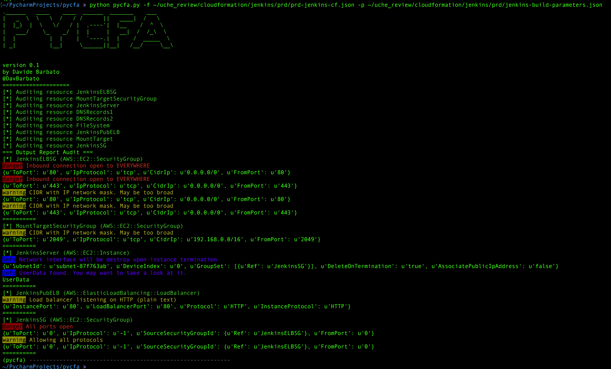

# Python CloudFormation Audit script
**pycfa**is a python script to audit CloudFormation template files for security misconfigurations.
It supports both JSON and YAML formats.

## Why?
I was looking to something similar to [Scout2](https://github.com/nccgroup/Scout2) but without the hassle of spinning up the whole infrastructure.
**pycfa**is particularly useful when you have to do a security audit of a series of CloudFormation template files.
I was looking for something quick and reliable. Here it is pycfa.

## How it works
pycfa reads rules from a file in JSON format (by default in `rules/rules.json`).
It provides a colorful output to stdout (by default) or in JSON format if `-j` flag is provided (without colors though).
The rule file syntax is as follow:

```json
  {
    "rules": [
      {
        "type": "<resource::type>",
        "key": "<path.to.key>",
        "match": "<strict | bool | regex>",
        "<what-to-check>": "<value>"
      }
    ],
    "level": "<info | warning | danger>",
    "description": "wut?"
  }
```
What the hell they mean? Here we go:
* **type**: the resource type as specified by the _Type_ tag (optional)
* **key**: path to the rule's parent key, starting after the _Proprieties_ key. e.g. if you want to check an IAM Policy _Action_ key, then this value will be _PolicyDocument.Statement_
* **match**: the way the field rules is interpreted.**strict**means "equal",**bool**check if the _what-to-check_ value exists, and**regexp**interpreters the _\<value>_ as a regular expression.
* **what-to-check**: this is the leaf key you want to check. It's in the form key:value, and this is actually the core of your rule.
* **level**: level of risk
* **description**: a description of the rule

**Please note**that the rules are evaluated as _AND_ at the moment.

## Usage
```sh
» python pycfa.py
.______   ____    ____  ______  _______    ___      
|   _  \  \   \  /   / /      ||   ____|  /   \     
|  |_)  |  \   \/   / |  ,----'|  |__    /  ^  \    
|   ___/    \_    _/  |  |     |   __|  /  /_\  \   
|  |          |  |    |  `----.|  |    /  _____  \  
| _|          |__|     \______||__|   /__/     \__\ 
                                                    

version 0.1
by Davide Barbato
@DavBarbato
====================
usage: pycfa.py [-h] [-d DIRPATH | -f CFTEMPLATE] [-p CFPARAMS]
                [-r CUSTOM_RULE] [-j]

optional arguments:
  -h, --help            show this help message and exit
  -d DIRPATH, --dir DIRPATH
                        specify a directory
  -f CFTEMPLATE, --file CFTEMPLATE
                        a CF template file
  -p CFPARAMS, --parameters CFPARAMS
                        parameters file for the CF template
  -r CUSTOM_RULE, --rules CUSTOM_RULE
                        specify a custom rule file
  -j, --json            output in JSON format
```

## Example


## Roadmap
* Make it context aware to better correlate resources
* Optimize code
* Terraform support!!!! (thanks to [json2hcl](https://github.com/kvz/json2hcl))
* Add more rules
* Better output (?)